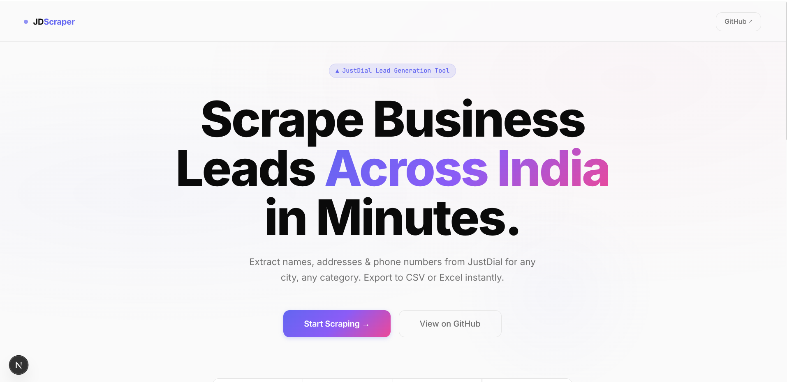
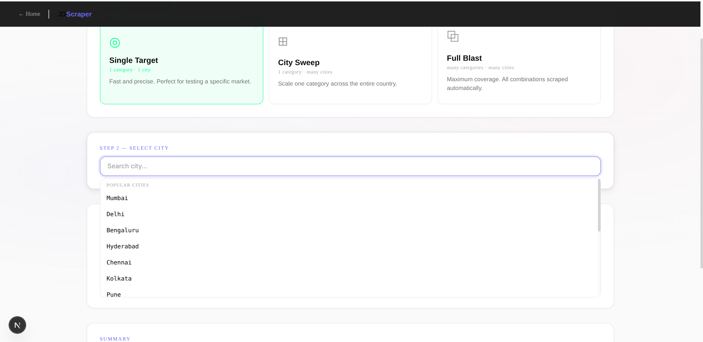
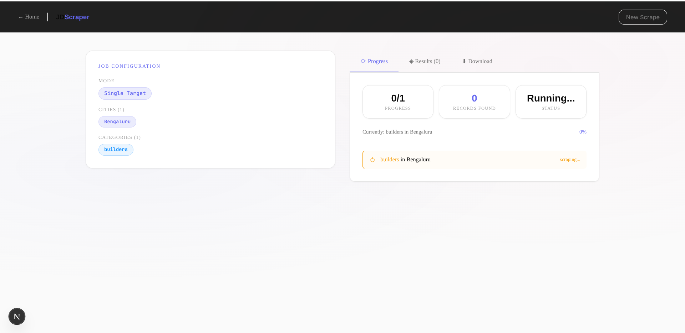
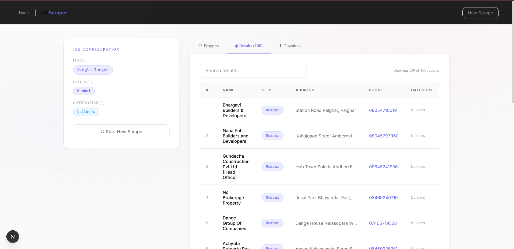
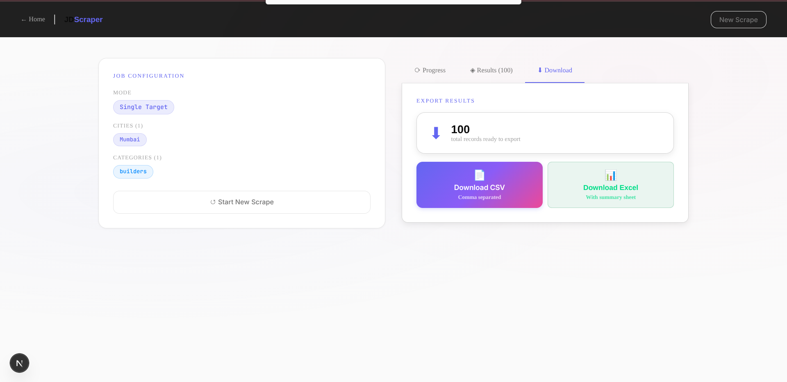

# 🚀 JustDial Scraper — Lead Generation Web App

A full-stack web application that extracts business leads from JustDial across hundreds of Indian cities with real-time tracking and instant export.

Built using **Next.js + Python Selenium**, this tool allows users to configure scraping jobs, monitor progress live, preview results, and download structured datasets in CSV or Excel format.

---

## 📸 Application Preview

### Landing Page



### Scraper Interface



### Live Progress Tracking



### Results



### Export



---

## ✨ Features

* 🎯 **3 Scraping Modes**

  * Single Target → One city, one category
  * City Sweep → One category across multiple cities
  * Full Blast → Multiple categories across multiple cities

* 🌍 **300+ Cities Support** — Searchable dropdown list

* ⚡ **Live Progress Tracking** — Real-time job updates

* 🔍 **Results Preview** — View data before download

* 📊 **Export Options** — CSV & Excel (with summary sheet)

* 🧠 **Smart Scraping** — Handles infinite scroll & popups

* 🎨 **Modern UI** — Clean, responsive dashboard

---

## 🛠️ Tech Stack

| Layer           | Technology                           |
| --------------- | ------------------------------------ |
| Frontend        | Next.js 14, TypeScript, Tailwind CSS |
| Backend         | Next.js API Routes (Node.js)         |
| Scraping Engine | Python, Selenium WebDriver           |
| Automation      | Headless Chrome, WebDriver Manager   |
| Export          | SheetJS (xlsx), CSV                  |

---

## 📂 Project Structure

```
JDScrapper/
│
├── frontend/                # Next.js application
│   ├── app/
│   │   ├── api/scrape/      # API routes
│   │   ├── scraper/         # Main UI page
│   │   └── page.tsx         # Landing page
│   ├── components/          # UI Components
│   └── lib/cities.ts        # Cities dataset
│
└── scraper/
    └── api_scraper.py       # Selenium scraping engine
```

---

## ⚙️ How It Works

```
User selects cities & categories
        ↓
Next.js frontend sends request
        ↓
API route launches Python scraper
        ↓
Selenium loads JustDial pages
        ↓
Extracts name, address, phone
        ↓
Frontend displays live results
        ↓
User downloads CSV/Excel
```

---

## 🚀 Installation

### 1. Clone Repository

```bash
git clone https://github.com/bhaskarchowdary826/JDScrapper.git
cd JDScrapper
```

### 2. Install Frontend Dependencies

```bash
cd frontend
npm install
```

### 3. Install Scraper Dependencies

```bash
cd ../scraper
pip install selenium webdriver-manager
```

---

## ▶️ Run Locally

```bash
cd frontend
npm run dev
```

Open → [http://localhost:3000](http://localhost:3000)

---

## 📊 Usage

1. Select scraping mode
2. Choose city/cities
3. Enter business category
4. Start scraping
5. Track progress live
6. Download results

---

## 🧠 Technical Highlights

* Infinite scroll detection to load all listings
* Popup handling during scraping
* Subprocess communication between Node and Python
* Structured dataset generation
* Real-time UI updates

---

## 👨‍💻 Author

**Bhaskar Chowdary**

GitHub: [https://github.com/bhaskarchowdary826](https://github.com/bhaskarchowdary826)

---

## ⚠️ Disclaimer

Use responsibly and follow JustDial terms of service.
For educational and research purposes only.

---